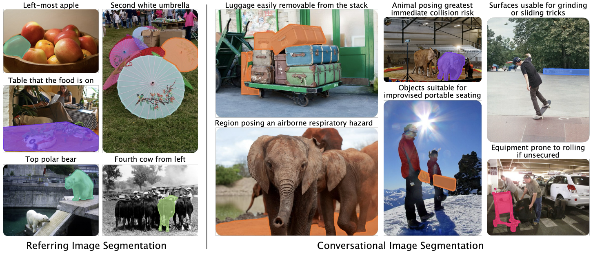

# Aligning Text, Images, and 3D Structure Token-by-Token

This repository contains the code for the webpage and demo for [Conversational Image Segmentation: Grounding Abstract Concepts with Scalable Supervision](https://glab-caltech.github.io/convseg/) 

[Aadarsh Sahoo](https://aadsah.github.io/), [Georgia Gkioxari](https://gkioxari.github.io/).

#### [Project Page](https://glab-caltech.github.io/convseg/) | [Paper]() | [Dataset]() | [BibTeX](#Citation)

